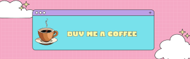

<h1 align="center">Hi ヾ(＾-＾),  I'm Ines Zenkri</h1>
<h3 align="center"> Passionate about coding, striving to innovate</h3>

- - -

<h3 align="left"> Connect with me  ^ _ ^ </h3>

<a href="https://www.linkedin.com/in/ines-zenkri/" target="blank">
  
<a>

- - - 

 

## 👩‍💻 Current Technical Skills

 

> :desktop_computer:  Languages - C | C++ | Markdown | Bash | HTML | CSS | PHP | JavaScript | Python

> :hammer_and_wrench:  Tools - Git | Stack Overflow

> :atom:  IDEs - Vim | PyCharm | Visual Studio Code | Xcode | Code::Blocks

 

&nbsp;&nbsp;&nbsp;&nbsp;&nbsp;&nbsp;

