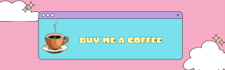

<h1 align="center">Hi ヾ(＾-＾),  I'm Ines Zenkri</h1>
<h3 align="center">Passionate about coding, striving to innovate 🚀</h3>

---

## About Me

I'm a passionate CS Student and tech enthusiast dedicated to building innovative solutions. I enjoy solving complex problems, learning new technologies, and contributing to open-source projects.

---

## Connect with Me

<h3 align="left"> ^ _ ^ </h3>

---

## Coding Activity

](https://skillicons.dev)

<b>📚 Detailed Breakdown</b>

> **💻 Languages:** C | C++ | Python | JavaScript | PHP | HTML | CSS | Bash | Markdown

> **🛠️ Tools:** Git | GitHub | Stack Overflow

> **🎨 IDEs:** Visual Studio Code | PyCharm | Vim | Xcode | Code::Blocks | Visual Studio

---

##  GitHub Statistics

---

## Support My Work

If you enjoy my projects, consider supporting me:

---

### ⭐ Let's collaborate and build something amazing together!

